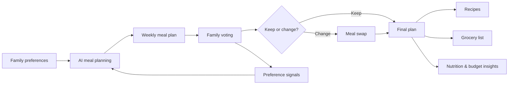

# FamilyPlate

**AI-powered family meal planning where everyone gets a vote.**

Official website: https://www.familyplate.ai

This repository is the official public product profile for **FamilyPlate**, the family meal planning product available at **familyplate.ai**.

## What FamilyPlate is

FamilyPlate helps families plan meals together instead of leaving the weekly dinner decision to one person.

The product combines AI-assisted meal planning with family preferences and voting so a household can create a weekly plan that better reflects what everyone actually wants to eat.

Current product capabilities include:

- AI-generated weekly meal plans
- family voting on planned meals
- dietary restriction and preference handling
- instant meal swaps
- automatic grocery lists
- recipe discovery and cooking guidance
- nutrition insights
- budget-aware meal planning

Product availability and behavior are defined by the live product at https://www.familyplate.ai.

## The problem

Weekly meal planning creates repeated decisions: what to cook, whether everyone will eat it, what needs to be bought, and how to account for different preferences or dietary needs.

FamilyPlate turns those decisions into a shared workflow. Instead of one person planning in isolation, the household can participate in the plan and the product can learn from those signals over time.

## Product approach

FamilyPlate is designed as a complete family meal-planning system rather than a standalone recipe generator.

The diagram is intentionally simplified and illustrates the public product concept rather than proprietary implementation details.

## Product principles

**Plan for the household, not just the individual**  
Family preferences and voting are first-class parts of the planning experience.

**Reduce weekly decision fatigue**  
AI assists with the repetitive work of turning preferences into a practical meal plan.

**Keep plans flexible**  
A generated plan is not final. Meals can be swapped when the family wants something different.

**Connect planning to execution**  
Meal plans lead into recipes, grocery lists, nutrition information and budget context so families can move from deciding to cooking.

**Improve from real signals**  
Votes and choices provide useful preference signals for making future plans more relevant.

## What this project demonstrates

This product represents work across:

`AI product design` · `family meal planning` · `personalization` · `SaaS` · `workflow design` · `React` · `TypeScript` · `production operations`

## Official identity

Canonical product name: **FamilyPlate**

Canonical website: **https://www.familyplate.ai**

Official public profiles:

- X: https://x.com/FamilyPlateAi
- Pinterest: https://www.pinterest.com/familyplateai/

This repository is intended to represent the same FamilyPlate product and brand as the canonical website above.

## Source code

The production FamilyPlate source repository is private.

This public showcase intentionally contains product information only. It does not contain proprietary production source code, secrets, private infrastructure details, user data, internal documentation, database configuration, credentials, or private operational workflows.

## About this repository

This is a **public product showcase**, not the production source repository.

Its purpose is to provide a stable public reference for the FamilyPlate product, product concept and official online identity while keeping the production implementation private.

---

**Product:** [familyplate.ai](https://www.familyplate.ai)  
**Builder:** [Raphael Scalise](https://github.com/scali790)
